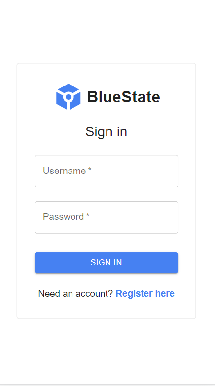
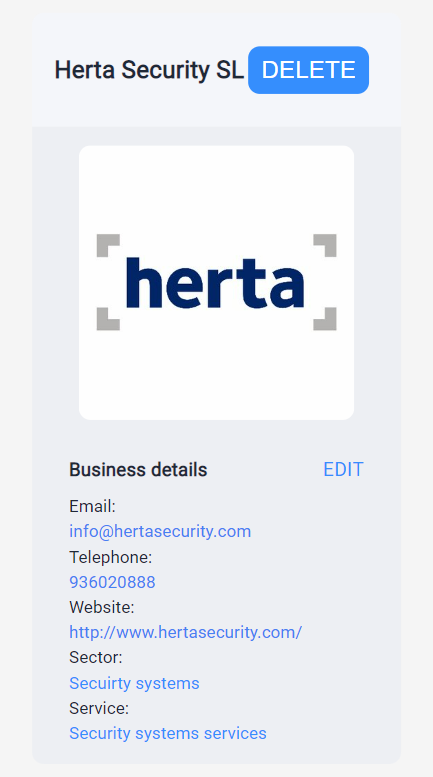
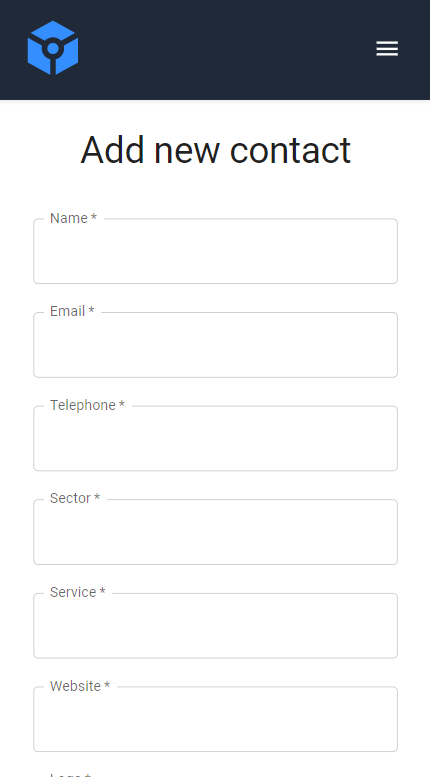

# BlueState

[Front App](https://oriol-raventos-front-final-project.netlify.app/)

[Back API](https://oriol-raventos-back-final-project-202209.onrender.com)

## Repositories

[Front-end](https://github.com/isdi-coders-2022/Oriol-Raventos_Front-Final-Project-202209-BCN)

[Back-end](https://github.com/isdi-coders-2022/Oriol-Raventos_Back-Final-Project-202209-BCN)

## SonarCloud

[Front-end](https://sonarcloud.io/summary/overall?id=isdi-coders-2022_Oriol-Raventos_Front-Final-Project-202209-BCN)

[Back-end](https://sonarcloud.io/summary/overall?id=isdi-coders-2022_Oriol-Raventos_Back-Final-Project-202209-BCN)

# Technologies

### TypeScript 4.9.3

### React 18.2.0

### Redux Toolkit 1.9.0

### Styled Components 5.3.6

### Jest 29.3.1

### Msw 0.49.0

### Axios 0.27.2

### Material UI 5.10.15

### React-router-dom 6.4.3

### Sharp 0.31.0

### Multer 1.4.7

### Express 4.17.14

### Jsonwebtoken 8.5.9

# PREVIEW

# Data layer

## Data

### User

**{username: string, password: string}**

### Business

**{name: string, email: string, telephone: number, location: string, service: string, website: string}**

### Business List

\***\*{business: [{name: string, email: string, telephone: number, location: string, service: string, website: string}]}\*\***

## Data modifications

- Register

        {username: string, password: string}

- Login

        {username: string, password: string, isLogged: true}

- Logout

        {username: string, password: string, isLogged: false}

- LoadBusinesses

        {
        businesses: [
        {name: string, email: string, telephone: number, location: string, service: string, website: string},
        {name: string, email: string, telephone: number, location: string, service: string, website: string},
        {name: string, email: string, telephone: number, location: string, service: string, website: string},
        {name: string, email: string, telephone: number, location: string, service: string, website: string},
        {name: string, email: string, telephone: number, location: string, service: string, website: string},
        {name: string, email: string, telephone: number, location: string, service: string, website: string},
        {name: string, email: string, telephone: number, location: string, service: string, website: string},
        {name: string, email: string, telephone: number, location: string, service: string, website: string},{name: string, email: string, telephone: number, location: string, service: string, website: string},
        {name: string, email: string, telephone: number, location: string, service: string, website: string}
        ]
        }

- LoadBusiness

        {name: string, email: string, telephone: number, location: string, service: string, website: string}

- DeleteBusiness

        {}

- Create/Update

        {name: string, email: string, telephone: number, location: string, service: string, website: string}

# Components

## Login form

### Show data

- Logo icon
- Heading level 1 title with the text "BlueState"
- Heading level 2 title with the text "Log in to BlueState"
- Input with a "Username" placeholder
- Input with a "Password" placeholder
- Button with the text "Log in"

### Get actions

- When submit it should call the log in action

## Navigation menu

### Show data

- Logo icon
- Nav element with the Navlinks "Contacts" and "Add business"
- Button with the text "Log out"

### Get actions

- When submited the button it should call the log out action
- When clicked on the logo icon it should reddirect the user to the contacts page
- When clicked on the Navlink "Contacts" it should reddirect the user to the contacts page
- When clicked on the Navlink "Add business" it should reddirect the user to the CreateForm page

## Log out button

### Show data

- A text "Log out"

### Get actions

- When clicked or submited the button it should call the log out action

## New contact button

### Show data

- A text "New contact"

### Get actions

- When clicked or submited the button it should reddirect the user to the CreateForm page

## Show all button

### Show data

- A text "Show all"

### Get actions

- When clicked or submited the button it should call the action loadBusinesses

## Delete button

### Show data

- A text "Delete"

### Get actions

- When clicked or submited the button it should call the action deleteBusiness

## BusinessesList

### Show data

- A table with the heading titles(Business name, email, telephone, number, service and website), table rows with the businesses data

### Get actions

- When clicked on a row or a label it should reddirect the user to the business details page

## CreateForm

### Show data

- Heading level 1 title with the text "Add a new business"
- Input with a "Business name" placeholder
- Input with a "Email" placeholder
- Input with a "Sector" placeholder
- Input with a "Website" placeholder
- Input with a "Location" placeholder
- Input with a "Service" placeholder
- Input with a File
- Button with the text "Add business"

### Get actions

- When submit it should call the createBusiness action

## UpdateForm

### Show data

- Heading level 1 title with the text "Add a new business"
- Input with a "Business name" placeholder
- Input with a "Email" placeholder
- Input with a "Sector" placeholder
- Input with a "Website" placeholder
- Input with a "Location" placeholder
- Input with a "Service" placeholder
- Input with a File
- Button with the text "Update business"

### Get actions

- When submit it should call the updateBusiness action

## SuccessModal

### Show data

- Success modal text

## ErrorModal

### Show data

- Error modal text

## Loading

### Show data

- Loading component
